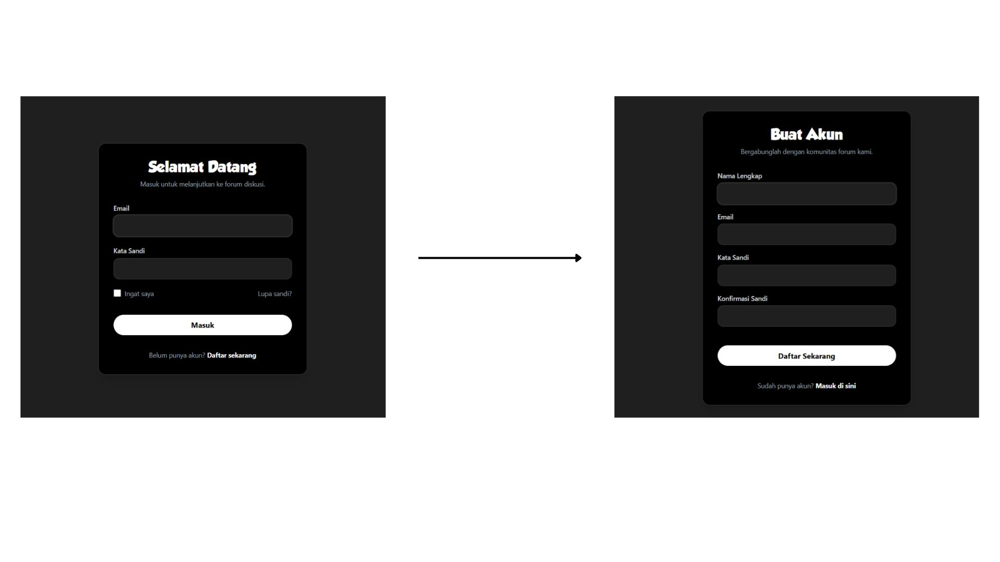
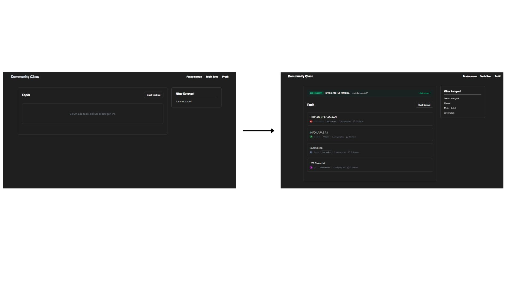
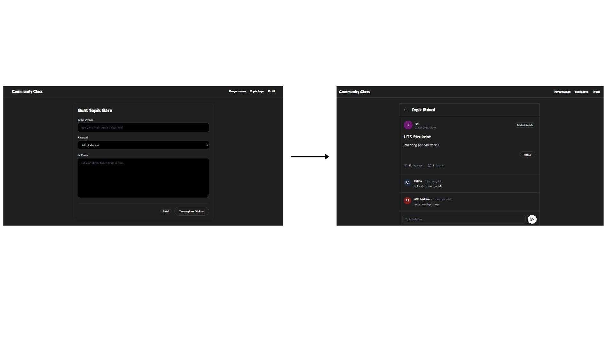

# Laravel-CommunityClass

CommunityClass is a web-based forum application designed to serve as a centralized hub for community discussions, academic knowledge sharing, and information broadcasting

## Overview

## Features
- **Login**, Allows a user to have an access to the application by entering their username and password
- **SignUp**, Enables users to register and have an access to the application.
- **Home**, The starting page that is displayed when you have logged in. It will allow users to view recent topics, filter discussions by category, and read community interactions.
- **Create Topic Screen**, This page will be displayed after the user chooses to start a new discussion. It allows users to submit their questions or insights by filling in the category and detailed message content.
- **Announcement Screen**, A dedicated page to broadcast important information or pinned updates to all forum members.
- **Topik Saya (My Topics)**, The users will be able to see their specific discussion history here and manage the topics they have created.
- **Profile Screen**, The users will be able to access their profile here. They can edit their account details or log out securely.

## Tech Stack
- Laravel 11 (Backend Framework
- Tailwind CSS (Styling)
- Vite (Frontend Asset Build Tool)
- MariaDB / MySQL (Database)

## Visit
<communityclass.infinityfree.me>
